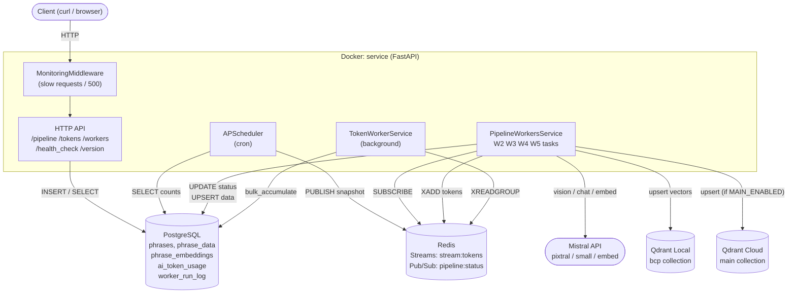
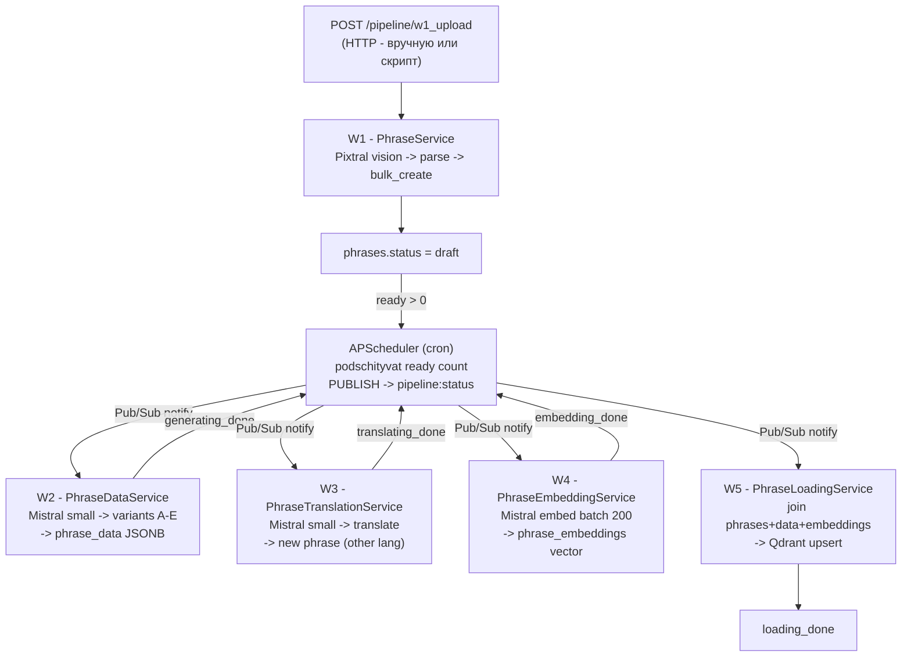
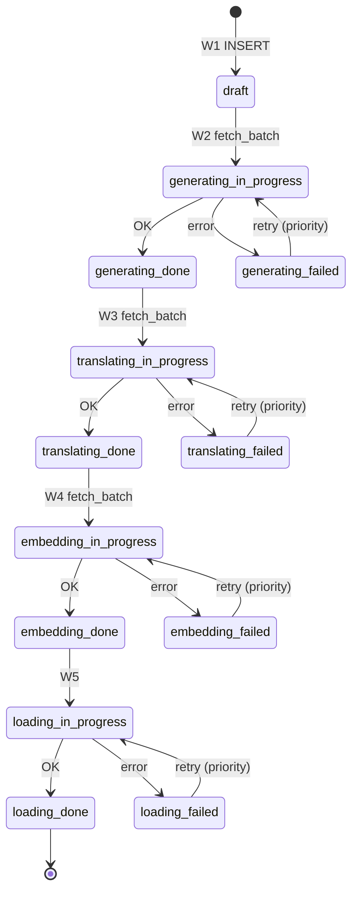
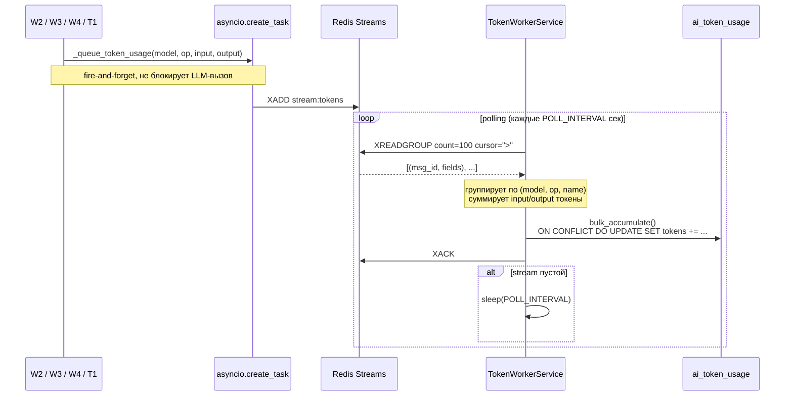
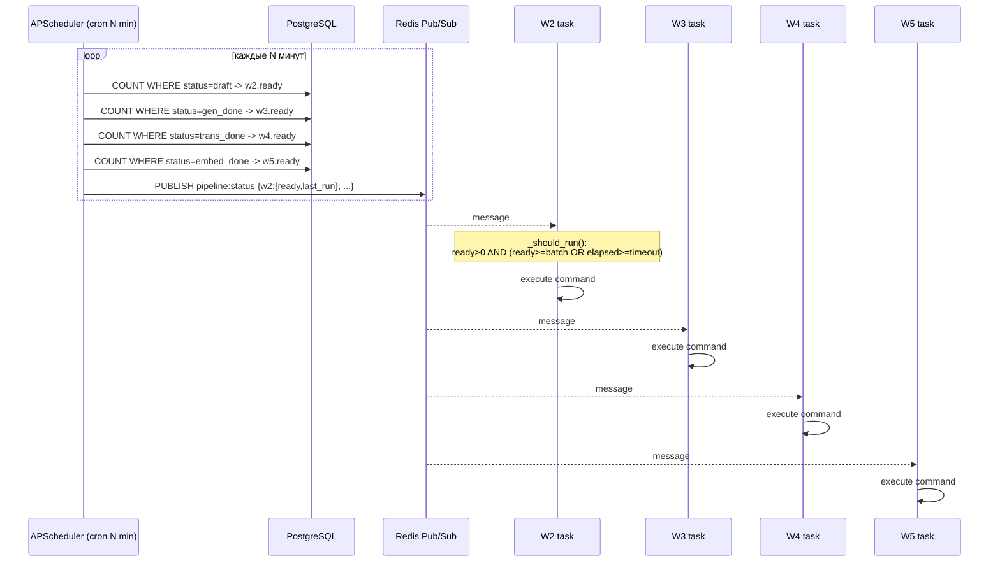
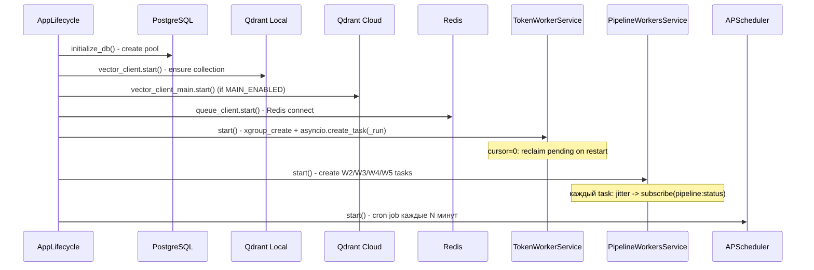
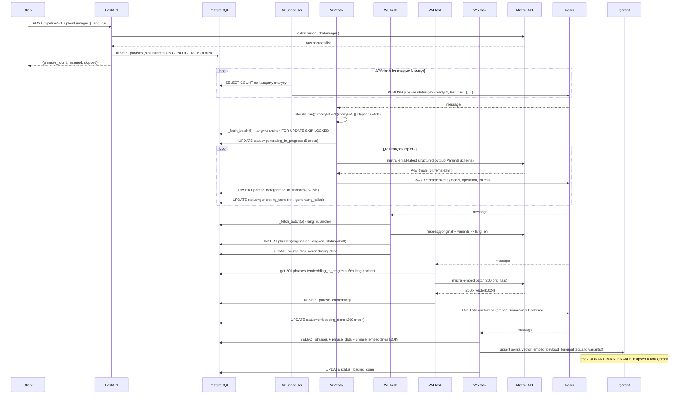
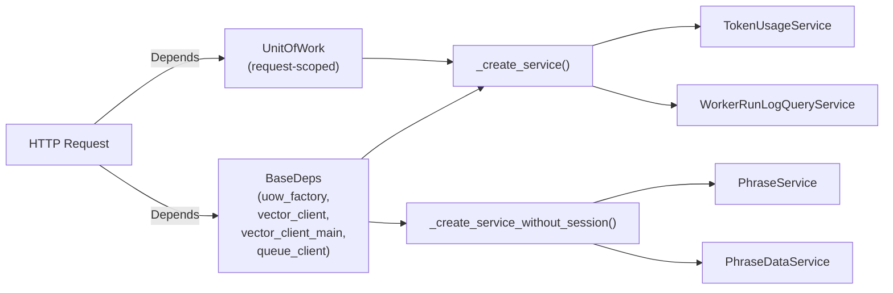
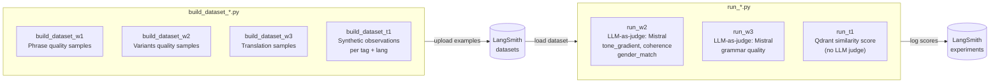

# lang1 - Qdrant Preprocessing Pipeline

## Mirror

**lang1** - вспомогательный микросервис проекта **Mirror**.

Mirror - система реального времени: браузерный клиент делает скриншоты экрана каждую секунду, группирует по 3-5 и периодически отправляет в API. API анализирует поведение пользователя через vision-модель, извлекает из Qdrant релевантные фразы с учётом категории и тональности и вбрасывает их двум AI-персонажам - условным "ангелу" и "демону". Персонажи ведут диалог между собой, реагируя на вброшенные фразы в своих ролях. Пользователь может в любой момент подключиться и парировать любому из персонажей, а также менять тон и настроение всей дискуссии в реальном времени.

Репозиторий: _[ссылка]_
Живой проект: _[URL]_

---

## lang1

Данный сервис отвечает за препроцессинг: наполняет Qdrant фразами-наблюдениями, чтобы было из чего выбирать в runtime. Pipeline из пяти воркеров (W1-W5) обрабатывает изображения через Pixtral, генерирует тональные варианты фраз через Mistral, переводит, строит embeddings и загружает результат в Qdrant. Параллельно ведётся полное наблюдение за потреблением токенов и аудит каждого запуска воркера.

## Стек

| Область | Технологии |
|---|---|
| API | FastAPI, uvicorn, aiohttp, python-multipart |
| База данных | SQLAlchemy 2.0 (async), asyncpg, psycopg2-binary, Alembic, PostgreSQL 15 |
| Конфигурация | Pydantic v2, pydantic-settings |
| Векторная БД | Qdrant, qdrant-client, grpcio, grpcio-tools |
| Очередь | Redis 7, redis-py (async) |
| AI / LLM | LangChain Core, langchain-mistralai, langchain-groq, langchain-text-splitters |
| Модели Mistral | pixtral-12b-2409, mistral-small-latest, mistral-embed |
| Модели Groq | llama-4-scout-17b (vision, резерв), llama-3.3-70b (резерв) |
| Планировщик | APScheduler |
| Evaluation | LangSmith, langsmith SDK, python-dotenv |
| Качество кода | black, ruff, mypy |
| Тесты | pytest, pytest-asyncio, pytest-cov, pytest-mock, httpx, testcontainers |
| Инфраструктура | Docker Compose |

---

## Запуск

```bash
cp .env.example .env
# заполнить переменные (см. таблицу ниже)
docker compose up --build
```

Миграции применяются автоматически при старте контейнера (`alembic upgrade head` запускается до `uvicorn`).

### Сервисы

| Сервис | Описание | Порт |
|---|---|---|
| `service` | FastAPI + все фоновые воркеры | `8000` |
| `db` | PostgreSQL 15 | `5433` |
| `qdrant` | Qdrant REST / Dashboard / gRPC | `6333` (REST + UI), `6334` (gRPC) |
| `redis` | Redis 7 | `6380` |

Swagger UI: http://localhost:8000/docs  
Qdrant Dashboard: http://localhost:6333/dashboard

### Переменные окружения

| Переменная | Обяз. | Описание |
|---|---|---|
| `APP_NAME` | + | Название приложения (отображается в `/version` и логах) |
| `APP_VERSION` | + | Версия приложения |
| `DEFAULT_TIMEZONE` | - | Часовой пояс APScheduler (default: `UTC`) |
| `POSTGRES_HOST` | + | Хост PostgreSQL (в Compose: `db`) |
| `POSTGRES_USER` | + | Пользователь PostgreSQL |
| `POSTGRES_PASSWORD` | + | Пароль PostgreSQL |
| `POSTGRES_PORT` | + | Порт PostgreSQL (в Compose: `5432`) |
| `POSTGRES_DB` | + | Имя базы данных |
| `POOL_SIZE` | + | Размер connection pool SQLAlchemy |
| `MAX_OVERFLOW` | + | Максимум дополнительных соединений при пике |
| `LOG_LEVEL` | + | `DEBUG` / `INFO` / `WARNING` |
| `MISTRAL_API_KEY` | + | Ключ Mistral (pixtral + small + embed) |
| `GROQ_API_KEY` | - | Ключ Groq (резервный vision, не обязателен в проде) |
| `QDRANT__SERVICE__API_KEY` | + | API-ключ локального Qdrant |
| `QDRANT_HOST` | + | Хост локального Qdrant (в Compose: `qdrant`) |
| `QDRANT_PORT` | + | REST-порт Qdrant (6333) |
| `QDRANT_GRPC_PORT` | + | gRPC-порт Qdrant (6334) |
| `QDRANT_PREFER_GRPC` | - | Использовать gRPC вместо REST (default: `true`) |
| `QDRANT_MAIN_ENABLED` | - | Включить второй (cloud/prod) Qdrant (default: `false`) |
| `QDRANT_MAIN_URL` | * | URL cloud Qdrant (нужен если `QDRANT_MAIN_ENABLED=true`) |
| `QDRANT_MAIN_API_KEY` | * | API-ключ cloud Qdrant |
| `VECTOR_DB_COLLECTION` | + | Имя коллекции в Qdrant |
| `VECTOR_DB_VECTOR_SIZE` | - | Размерность вектора (default: `1024`) |
| `T1_SEARCH_MIN_SCORE` | - | Минимальный score для T1-поиска (default: `0.85`) |
| `REDIS_HOST` | + | Хост Redis (в Compose: `redis`) |
| `REDIS_PORT` | + | Порт Redis (6379) |
| `REDIS_DB` | - | Номер БД Redis (default: `0`) |
| `REDIS_TOKENS_STREAM` | - | Имя stream для токенов (default: `stream:tokens`) |
| `REDIS_TOKENS_GROUP` | - | Consumer group (default: `token_workers`) |
| `REDIS_TOKENS_BATCH_SIZE` | - | Размер батча чтения из stream (default: `100`) |
| `REDIS_TOKENS_POLL_INTERVAL` | - | Интервал polling в секундах (default: `60`) |
| `REDIS_PIPELINE_CHANNEL` | - | Pub/Sub канал диспетчера (default: `pipeline:status`) |
| `PIPELINE_W2_BATCH_SIZE` | - | Размер батча W2 (default: `5`) |
| `PIPELINE_W2_TIMEOUT_SEC` | - | Cooldown W2 между запусками (default: `60`) |
| `PIPELINE_W3_BATCH_SIZE` | - | Размер батча W3 (default: `5`) |
| `PIPELINE_W3_TIMEOUT_SEC` | - | Cooldown W3 (default: `60`) |
| `PIPELINE_W4_BATCH_SIZE` | - | Размер батча W4 (default: `200`) |
| `PIPELINE_W4_TIMEOUT_SEC` | - | Cooldown W4 (default: `3600`) |
| `PIPELINE_W5_BATCH_SIZE` | - | Размер батча W5 (default: `400`) |
| `PIPELINE_W5_TIMEOUT_SEC` | - | Cooldown W5 (default: `3600`) |
| `STUCK_THRESHOLD` | - | Минут до пометки зависшего воркера (default: `10`) |

### Остановка

```bash
docker compose down        # остановить, сохранить данные
docker compose down -v     # остановить и удалить все данные (Postgres / Qdrant / Redis)
```

---

## Диаграммы

### Общая архитектура



### Pipeline W1-W5



### Статусная машина phrases



### TokenWorkerService - подсчёт токенов



### APScheduler - диспетчер воркеров



### Qdrant - local vs cloud

```mermaid
graph LR
    subgraph Dev["Dev / Preprocessing (QDRANT_MAIN_ENABLED=false)"]
        W5D["W5"] -->|upsert| QDL["Qdrant Local\nlocalhost:6333"]
        T1D["T1 Search"] -->|search| QDL
    end

    subgraph Prod["Prod (QDRANT_MAIN_ENABLED=true)"]
        W5P["W5"] -->|upsert| QDL2["Qdrant Local"]
        W5P -->|upsert (mirror)| QDC["Qdrant Cloud\nQDRANT_MAIN_URL"]
        T1P["T1 Search (prod)"] -->|search| QDC
    end
```

### Жизненный цикл приложения



### Полный поток одной фразы (W1 -> Qdrant)



### DI-граф сервисов



### Evaluation (LangSmith)



---

## Воркеры W1-W5

Каждый воркер — одна стадия конвейера. Фраза проходит их последовательно, меняя статус в таблице `phrases`. Воркеры W2-W5 запускаются планировщиком в фоне; W1 — только по HTTP-запросу.

---

### W1 - загрузка изображений

**Сервис:** `PhraseService`  
**Запуск:** только вручную через `POST /pipeline/w1_upload`  
**Модель:** `pixtral-12b-2409` (Mistral Vision), таймаут 120 с  
**Статус на выходе:** `draft`

**Что делает:**

Принимает список изображений и код языка (`ru` или `en`). Кодирует каждое фото в base64 и отправляет все разом одним вызовом к vision-модели. Промпт просит описать происходящее на фото по шести тегам:

| Тег | Что описывает |
|-----|---------------|
| `behavior` | что делает, чем занимается |
| `appearance` | внешний вид, опрятность |
| `age` | возраст |
| `mood` | настроение |
| `posture` | поза, как сидит/стоит |
| `hairstyle` | причёска или головной убор |

Для каждого тега модель генерирует **5 вариантов**, каждый вариант — два поля: `concrete` (конкретное наблюдение 5-6 слов) и `abstract` (образная мысль 5-6 слов). Итого на одно фото: 6 тегов × 5 вариантов = **30 записей**.

Воркер объединяет `concrete` и `abstract` через `. ` — получается исходная фраза (`original`). Дубли отсеиваются по тексту, затем делается `bulk_create` с `ON CONFLICT DO NOTHING`. После этого фразы получают статус `draft` и попадают в очередь W2.

**Возвращает:** `phrases_found`, `inserted`, `skipped`

---

### W2 - генерация тональных вариантов

**Сервис:** `PhraseDataService`  
**Запуск:** автоматически по планировщику  
**Модель:** `mistral-small-latest`, таймаут 60 с  
**Батч:** 5 фраз за цикл (lang-anchor)  
**Статус:** `draft` → `generating_done` / `generating_failed`

**Что делает:**

Забирает батч фраз со статусом `draft`. Все фразы батча — **одного языка** (lang-anchor: первая свободная фраза фиксирует язык, остальные подбираются под него). Захват атомарный — `FOR UPDATE SKIP LOCKED`, чтобы параллельные процессы не брали одно и то же.

Для каждой фразы просит Mistral сгенерировать короткие комментарии в **5 тонах × 2 пола × 5 фраз** каждый = 50 вариантов на одну фразу:

| Тон | Характер |
|-----|----------|
| `A` | цинично - грубо, с насмешкой, жёстко, но без мата |
| `B` | прямолинейно - честно и сухо, говорит как есть |
| `C` | нормально - нейтральный тон, обычная речь |
| `D` | комплиментарно - мягко, с лёгкой похвалой |
| `E` | хвалебно - восторженно, максимально позитивно |

Каждый тон разделён на `male` и `female` - обращение подстраивается под пол. Результат пишется в `phrase_data.variants` (JSONB). Использованные токены отправляются в Redis Streams (fire-and-forget).

---

### W3 - перевод на второй язык

**Сервис:** `PhraseTranslationService`  
**Запуск:** автоматически по планировщику  
**Модель:** `mistral-small-latest`, таймаут 60 с  
**Батч:** 5 фраз за цикл (lang-anchor)  
**Статус:** `generating_done` → `translating_done` / `translating_failed`

**Что делает:**

Забирает фразы со статусом `generating_done`. Определяет язык батча и целевой язык (`ru` → `en` или `en` → `ru`). Подгружает из `phrase_data` все варианты A-E × male/female для каждой фразы и отправляет всё вместе в Mistral.

Модель переводит:
- `original` - исходный текст фразы в поле `translated`
- все 50 вариантов тонов - сохраняя характер каждого (`A` остаётся циничным, `E` - восторженным)

Переведённый текст создаётся как **новая строка** в таблице `phrases` (другой lang), сразу со статусом `translating_done`. Для неё же создаётся запись в `phrase_data` с переведёнными вариантами. Исходная фраза помечается как `translating_done`.

---

### W4 - векторизация

**Сервис:** `PhraseEmbeddingService`  
**Запуск:** автоматически по планировщику  
**Модель:** `mistral-embed`  
**Батч:** до 200 фраз за цикл (без lang-anchor)  
**Статус:** `translating_done` → `embedding_done` / `embedding_failed`

**Что делает:**

Забирает фразы со статусом `translating_done`. В отличие от W2/W3, **lang-anchor не используется** - W4 берёт смешанный батч любых языков, поскольку векторизация не зависит от языка.

Все тексты батча отправляются одним запросом в Mistral Embeddings API. Ответ - список **1024-мерных векторов float32**. Воркер проверяет, что количество векторов совпадает с количеством фраз, и записывает их в таблицу `phrase_embeddings`. Токены (только input, output = 0 для embeddings) уходят в Redis Streams.

---

### W5 - загрузка в Qdrant

**Сервис:** `PhraseLoadingService`  
**Запуск:** автоматически по планировщику  
**Модель:** нет (Qdrant upsert)  
**Батч:** до 400 фраз за цикл  
**Статус:** `embedding_done` → `loading_done` / `loading_failed`

**Что делает:**

Забирает фразы со статусом `embedding_done` и за один `UnitOfWork` подгружает для них векторы (`phrase_embeddings`) и варианты (`phrase_data`). Если у фразы нет вектора или нет вариантов - она помечается как `failed` и пропускается.

Для каждой готовой фразы строится `PointStruct`:

```python
PointStruct(
    id=phrase.id,
    vector=embedding,           # 1024 float32
    payload={
        "id": phrase.id,
        "uuid": str(uuid4()),
        "original": phrase.original,
        "tag": phrase.tag,
        "lang": phrase.lang,    # "ru" или "en"
        "variants": variants,   # dict A-E x male/female
    }
)
```

Все точки уходят в **локальный Qdrant** (всегда). Если переменная `QDRANT_MAIN_ENABLED=true` - параллельно и в **облачный Qdrant** (prod). Фразы, успешно загруженные в Qdrant, получают финальный статус `loading_done`.

---

## Структура проекта

```
.
├── app/
│   ├── adapters/                          # Внешние клиенты - абстракции + реализации
│   │   ├── embeddings_client.py           # EmbeddingsClientAbstract + MistralEmbedClient
│   │   ├── queue_client.py                # MessageQueueClientAbstract + RedisClient
│   │   │                                  #   xadd / xreadgroup / xack / publish / subscribe
│   │   └── vector_client.py               # VectorClientAbstract + QdrantClientWrapper
│   │                                      #   upsert / search / collection bootstrap
│   ├── api/                               # FastAPI роутеры
│   │   ├── __init__.py                    # Корневой роутер: /version + include всех роутеров
│   │   ├── health_check.py                # GET /health_check
│   │   ├── pipeline_router.py             # POST /pipeline/w1_upload ... w5_load
│   │   ├── tokens_router.py               # GET /tokens/usage, /tokens/usage/aggregate
│   │   ├── workers_router.py              # GET /workers/runs
│   │   └── test_router.py                 # POST /test_routes/t1_search
│   ├── commands/                          # Command pattern: каждый воркер - отдельная команда
│   │   ├── base.py                        # BaseCommand: execute() + лог в worker_run_log
│   │   ├── w2_command.py                  # CommandW2 -> PhraseDataService.w2_generate()
│   │   ├── w3_command.py                  # CommandW3 -> PhraseTranslationService.w3_translate()
│   │   ├── w4_command.py                  # CommandW4 -> PhraseEmbeddingService.w4_embed()
│   │   └── w5_command.py                  # CommandW5 -> PhraseLoadingService.w5_load()
│   ├── common/                            # Общие примитивы
│   │   ├── enums.py                       # TagEnum, MoodEnum, LangEnum,
│   │   │                                  #   PhraseStatusEnum (13 статусов), WorkerStatusEnum
│   │   ├── exceptions.py                  # Доменные исключения по каждому этапу pipeline
│   │   └── logging.py                     # logger + @log_decorator
│   ├── core/                              # Инфраструктура
│   │   ├── config.py                      # Settings (pydantic-settings): все env-переменные
│   │   │                                  #   computed props: database_url, log_level,
│   │   │                                  #   pipeline_cron_minutes, default_timezone
│   │   ├── database.py                    # async_engine (asyncpg), session_maker,
│   │   │                                  #   initialize_db() / shutdown_db()
│   │   └── vector_database.py             # bootstrap Qdrant: create_collection if not exists,
│   │                                      #   payload indices (tag, lang), HNSW config
│   ├── dependencies/                      # FastAPI DI-фабрики
│   │   ├── infrastructure.py              # get_vector_client / get_vector_client_main /
│   │   │                                  #   get_queue_client / get_phrase_vector_repository
│   │   └── services.py                    # _create_service() / _create_service_without_session()
│   │                                      #   get_token_usage_service, get_worker_run_log_service,
│   │                                      #   get_phrase_service, get_phrase_data_service, ...
│   ├── migrations/                        # Alembic
│   │   ├── env.py                         # async migrations с SQLAlchemy 2.0
│   │   └── versions/                      # 12 миграций: phrases, phrase_data, embeddings,
│   │                                      #   ai_token_usage, worker_run_log, индексы
│   ├── models/                            # SQLAlchemy ORM-модели
│   │   ├── base.py                        # Base + int_pk Mapped type
│   │   ├── phrases.py                     # Phrase: original, tag, lang, status
│   │   │                                  #   UNIQUE(original, lang), Index(status, updated_at)
│   │   ├── phrase_data.py                 # PhraseData: phrase_id FK, variants JSONB
│   │   ├── phrase_embeddings.py           # PhraseEmbedding: phrase_id FK, vector ARRAY[float]
│   │   ├── ai_token_usage.py              # AiTokenUsage: model, date, name, operation,
│   │   │                                  #   input_tokens, output_tokens - UNIQUE(4 поля)
│   │   └── worker_run_log.py              # WorkerRunLog: worker, status, batch_size,
│   │                                      #   finished_at, result JSONB, created_at
│   ├── pyd/                               # Pydantic-схемы
│   │   ├── requests.py                    # Pagination, AITokenFilter, WorkerRunLogFilter,
│   │   │                                  #   TagExclusionFilters, SearchSettings
│   │   ├── responses.py                   # PaginatedAiTokenUsageItemList, AiTokenAggregatedItem,
│   │   │                                  #   PaginatedWorkerRunLogList, WorkerRunLogItem,
│   │   │                                  #   W2/W3/W4/W5/UploadImagesResponse, BasePaginated
│   │   └── ai_schemas.py                  # LangChain structured output схемы (VariantsSchema, ...)
│   ├── repositories/                      # Слой доступа к данным
│   │   ├── base_repository.py             # BaseRepository(session: AsyncSession)
│   │   ├── repository_error_handler.py    # @repository_error_handler: IntegrityError -> домен
│   │   ├── phrase_repository.py           # bulk_create (ON CONFLICT DO NOTHING),
│   │   │                                  #   get_first_for_processing, get_batch_for_processing,
│   │   │                                  #   update_status (FOR UPDATE SKIP LOCKED)
│   │   ├── phrase_data_repository.py      # upsert phrase_data (ON CONFLICT UPDATE variants)
│   │   ├── phrase_embedding_repository.py # upsert phrase_embeddings
│   │   ├── phrase_vector_repository.py    # Qdrant upsert (local + main)
│   │   ├── ai_token_usage_repository.py   # list_usage (пагинация), aggregate_usage (SUM),
│   │   │                                  #   bulk_accumulate (ON CONFLICT DO UPDATE накопление)
│   │   └── worker_run_log_repository.py   # create, finish, list_runs, abandon_running
│   ├── services/                          # Бизнес-логика
│   │   ├── base.py                        # BaseDeps (dataclass), BaseService,
│   │   │                                  #   BaseWorkerService (DRY: _fetch_batch, _fire_token_task)
│   │   ├── phrase_service.py              # W1: upload_images -> Pixtral -> parse -> bulk_create
│   │   ├── phrase_data_service.py         # W2: w2_generate -> _fetch_batch -> LCEL chain -> upsert
│   │   ├── phrase_translation_service.py  # W3: w3_translate -> _fetch_batch -> Mistral -> INSERT
│   │   ├── phrase_embedding_service.py    # W4: w4_embed -> MistralEmbed batched -> upsert
│   │   ├── phrase_loading_service.py      # W5: w5_load -> join -> Qdrant upsert
│   │   ├── phrase_search_service.py       # T1: vision -> embed -> Qdrant search -> filter
│   │   ├── token_usage_service.py         # list_usage + aggregate_usage (read-only)
│   │   ├── worker_run_log_query_service.py # list_runs (read-only, request UoW)
│   │   ├── worker_run_log_service.py      # create/finish/abandon_running (factory UoW)
│   │   ├── pipeline_workers_service.py    # управление asyncio-задачами W2-W5
│   │   ├── token_worker_service.py        # Redis Streams -> ai_token_usage (фоновый)
│   │   ├── health_check_service.py        # ping DB + Qdrant + Redis
│   │   └── prompt_service.py             # PROMPT_PIXTRAL_RU / PROMPT_PIXTRAL_EN
│   ├── utils/
│   │   └── pipeline_scheduler_func.py    # APScheduler job: SELECT counts -> PUBLISH snapshot
│   ├── lifecycle.py                       # AppLifecycle: on_startup / on_shutdown
│   ├── main.py                            # FastAPI app + lifespan
│   ├── middleware.py                      # MonitoringMiddleware: slow requests + 500 catch-all
│   └── uow.py                             # UnitOfWork + get_uow (request) + get_uow_factory
├── evaluation/                            # Evaluation pipeline (LangSmith)
│   ├── config.py                          # параметры выборки, имена датасетов, judge temperature
│   ├── build_dataset_w1.py                # сборка датасета W1 (phrase quality)
│   ├── build_dataset_w2.py                # сборка датасета W2 (variants quality)
│   ├── build_dataset_w3.py                # сборка датасета W3 (translation quality)
│   ├── build_dataset_t1.py                # сборка датасета T1 (synthetic observations)
│   ├── run_w1.py                          # запуск evaluation W1
│   ├── run_w2.py                          # запуск evaluation W2
│   ├── run_w3.py                          # запуск evaluation W3
│   ├── run_t1.py                          # запуск evaluation T1 (Qdrant retrieval score)
│   └── evaluators/
│       ├── variants_quality_w2.py         # LLM-as-judge: tone_gradient, coherence, gender_match
│       ├── grammar_w3.py                  # LLM-as-judge: grammar quality translations
│       └── tag_relevance.py               # оценка соответствия фразы тегу
├── tests/
├── docker-compose.yml
├── Dockerfile
├── alembic.ini
├── pyproject.toml
├── DOCSTRING_STANDARD.md
├── TASK.md
└── .env.example
```

---

## Схема базы данных

```
phrases                                    worker_run_log
  id          BIGSERIAL PK                   id          BIGSERIAL PK
  original    VARCHAR                        worker      VARCHAR(50) INDEX
  tag         VARCHAR(20)  -> TagEnum        status      WorkerStatusEnum
  lang        LangEnum     -> ru / en        batch_size  INT nullable
  status      PhraseStatusEnum               finished_at TIMESTAMPTZ nullable
  updated_at  TIMESTAMPTZ                    result      JSONB nullable
  UNIQUE(original, lang)                     created_at  TIMESTAMPTZ
  INDEX(status, updated_at)
       |
       | 1:1
       |---> phrase_data                  ai_token_usage
       |       id        BIGSERIAL PK       id            BIGSERIAL PK
       |       phrase_id FK                 model         VARCHAR(100)
       |       variants  JSONB              date          DATE
       |                                    name          VARCHAR(100)  default='system'
       '---> phrase_embeddings              operation     VARCHAR(100)
               id        BIGSERIAL PK       input_tokens  BIGINT
               phrase_id FK                 output_tokens BIGINT
               vector    ARRAY[float]       updated_at    TIMESTAMPTZ
                                            UNIQUE(model, date, name, operation)
```

### Структура payload Qdrant

```json
{
  "vector": [0.021, -0.134, ...],
  "payload": {
    "original": "sits hunched over the keyboard",
    "tag": "posture",
    "lang": "en",
    "variants": {
      "A": { "male": ["phrase1", "phrase2", "phrase3", "phrase4", "phrase5"],
             "female": ["phrase1", "phrase2", "phrase3", "phrase4", "phrase5"] },
      "B": { "male": [...], "female": [...] },
      "C": { "male": [...], "female": [...] },
      "D": { "male": [...], "female": [...] },
      "E": { "male": [...], "female": [...] }
    }
  }
}
```

Mood (A-E) и gender выбирает клиент при поиске - они не влияют на вектор. Эмбеддинг строится только по полю `original`.

### Назначение таблиц

| Таблица | Зачем |
|---|---|
| `phrases` | Реестр всех фраз-наблюдений. Живёт вечно. Статусная машина pipeline. Дедупликация по UNIQUE(original, lang). |
| `phrase_data` | Staging-таблица: хранит JSONB с вариантами A-E (male/female) до загрузки в Qdrant. Одна строка на phrase. |
| `phrase_embeddings` | Хранит вектор 1024-float для каждой фразы. W4 пишет сюда, W5 читает отсюда при сборке Qdrant-payload. |
| `ai_token_usage` | Дневная агрегация потребления токенов по (model, date, name, operation). Накапливается через ON CONFLICT DO UPDATE. |
| `worker_run_log` | Аудит каждого батча каждого воркера: старт, финиш, размер, результат или ошибка. Видно через GET /workers/runs. |

---

## API Reference

Swagger UI: http://localhost:8000/docs

### Служебные

#### `GET /version`

Возвращает строку с именем и версией приложения из конфига.

**Ответ `200`:** `"my-service, v0.1.0"` (строка)

---

#### `GET /health_check`

Пингует PostgreSQL, Qdrant и Redis. Используется как liveness probe.

**Ответ `200`:** пустое тело - все компоненты доступны

**Ответ `503`:** `{"detail": "...", "status_code": 503}` - один из компонентов недоступен

---

### Pipeline

Все pipeline-эндпоинты - `POST`. Запускают одну итерацию воркера вручную. В штатном режиме воркеры W2-W5 запускаются автоматически через APScheduler.

#### `POST /pipeline/w1_upload`

Загрузить изображения -> Pixtral vision -> вставить извлечённые фразы в `phrases`.

**Тип запроса:** `multipart/form-data`

| Параметр | Тип | Где | Обязателен | Описание |
|---|---|---|---|---|
| `images` | `UploadFile[]` | form | + | Одно или несколько изображений |
| `lang` | `"ru"` / `"en"` | query | - | Язык фраз (default: `ru`) |

**Ответ `200`:** `{"phrases_found": int, "inserted": int, "skipped": int, "error": str|null}`

При ошибке Pixtral: возвращает `200` с `phrases_found=0` и `error=<описание>` - не прерывает работу API.

---

#### `POST /pipeline/w2_generate`

Один батч генерации вариантов: `draft` -> Mistral `mistral-small-latest` -> JSONB variants -> `generating_done`.

| Параметр | Тип | Где | Default | Описание |
|---|---|---|---|---|
| `batch_size` | `int (1-50)` | query | `PIPELINE_W2_BATCH_SIZE` | Максимальный размер батча |

**Ответ `200`:** `{"processed": int, "failed": int, "skipped": int, "error": str|null}`

---

#### `POST /pipeline/w3_translate`

Один батч перевода: `generating_done` -> Mistral -> новая запись в `phrases` на другом языке -> `translating_done`.

| Параметр | Тип | Где | Default | Описание |
|---|---|---|---|---|
| `batch_size` | `int (1-50)` | query | `PIPELINE_W3_BATCH_SIZE` | Максимальный размер батча |

**Ответ `200`:** `{"processed": int, "failed": int, "skipped": int, "error": str|null}`

---

#### `POST /pipeline/w4_embed`

Один батч эмбеддингов: `translating_done` -> Mistral `mistral-embed` (до 200 за вызов) -> вектор 1024d -> `embedding_done`.

| Параметр | Тип | Где | Default | Описание |
|---|---|---|---|---|
| `batch_size` | `int (1-500)` | query | `PIPELINE_W4_BATCH_SIZE` | Максимальный размер батча |

**Ответ `200`:** `{"processed": int, "failed": int, "skipped": int, "error": str|null}`

---

#### `POST /pipeline/w5_load`

Один батч загрузки в Qdrant: `embedding_done` -> join phrase + phrase_data + phrase_embeddings -> Qdrant upsert (local + cloud если `QDRANT_MAIN_ENABLED`) -> `loading_done`.

| Параметр | Тип | Где | Default | Описание |
|---|---|---|---|---|
| `batch_size` | `int (1-2000)` | query | `PIPELINE_W5_BATCH_SIZE` | Максимальный размер батча |

**Ответ `200`:** `{"processed": int, "failed": int, "skipped": int, "upserted": int}`

**Ответ `409`:** нарушение уникальности при загрузке.

---

### Токены

#### `GET /tokens/usage`

Постраничный список записей потребления токенов из `ai_token_usage`.

| Параметр | Тип | Описание |
|---|---|---|
| `date_from` / `date_to` | `date` | Диапазон дат (включительно) |
| `model` | `str` | Фильтр по модели (ILIKE `%value%`) |
| `name` | `str` | Фильтр по актору (ILIKE `%value%`) |
| `operation` | `str` | Префикс операции: 2 символа, буква + цифра (`w2`, `t1`). ILIKE `value%` |
| `exclude_input` | `bool` | Обнулить `input_tokens` в ответе (не WHERE-условие) |
| `exclude_output` | `bool` | Обнулить `output_tokens` в ответе |
| `per_page` / `page` | `int > 0` | Пагинация (default: 25 / 1) |

**Ответ `200`:**
```json
{
  "per_page": 25, "page": 1, "total_count": 142,
  "items": [
    {
      "model": "mistral-small-latest", "date": "2026-07-08",
      "name": "system", "operation": "w2_generate",
      "input_tokens": 12480, "output_tokens": 3210,
      "total_tokens": 15690, "updated_at": "2026-07-08T14:30:01Z"
    }
  ]
}
```

---

#### `GET /tokens/usage/aggregate`

Суммарное потребление по активным фильтрам. Возвращает один плоский объект.

Параметры фильтрации - те же что у `/tokens/usage` (без `per_page`/`page`).

Поля `model`/`name`/`operation` в ответе: если переданы как фильтр - отражают значение фильтра, если нет - `null`.

**Ответ `200`:**
```json
{
  "model": null, "name": null, "operation": "w2",
  "input_tokens": 184320, "output_tokens": 52140, "total_tokens": 236460
}
```

---

### Воркеры

#### `GET /workers/runs`

Постраничный список запусков воркеров из `worker_run_log`. Сортировка по `created_at DESC`.

| Параметр | Тип | Описание |
|---|---|---|
| `worker` | `str` | Префикс имени воркера (ILIKE `value%`, e.g. `w2`, `token`) |
| `status` | `running / done / failed` | Статус запуска |
| `started_from` / `started_to` | `date` | Диапазон по `created_at` |
| `per_page` / `page` | `int > 0` | Пагинация (default: 25 / 1) |

**Ответ `200`:**
```json
{
  "per_page": 25, "page": 1, "total_count": 348,
  "items": [
    {
      "id": 348, "worker": "w4_embed", "status": "done",
      "batch_size": 200, "finished_at": "2026-07-08T14:25:03Z",
      "result": {"processed": 200, "failed": 0, "skipped": 0},
      "created_at": "2026-07-08T14:22:47Z"
    }
  ]
}
```

---

### T1 Search

#### `POST /test_routes/t1_search`

Полный runtime-пайплайн: изображение -> Pixtral vision -> Mistral embed -> Qdrant search -> варианты фраз по mood и gender.

**Тип запроса:** `multipart/form-data`

| Параметр | Тип | Где | Описание |
|---|---|---|---|
| `image` | `UploadFile` | form | Одно изображение |
| `lang` | `ru / en` | query | Язык результатов (default: `ru`) |
| `mood` | `A-E` | query | Тональность: A=цинично, B=прямо, C=нормально, D=дружески, E=хвалебно (default: `C`) |
| `not_behavior` | `bool` | query | Исключить тег `behavior` |
| `not_appearance` | `bool` | query | Исключить тег `appearance` |
| `not_age` | `bool` | query | Исключить тег `age` |
| `not_mood` | `bool` | query | Исключить тег `mood` |
| `not_posture` | `bool` | query | Исключить тег `posture` |
| `not_hairstyle` | `bool` | query | Исключить тег `hairstyle` |

Поиск в Qdrant: vector similarity с `min_score=T1_SEARCH_MIN_SCORE` (default 0.85), фильтрация по `lang` и исключённым тегам через Qdrant payload filter.

**Ответ `200`:** плоский список строк-вариантов, отфильтрованных по mood и случайно выбранных по gender.

---


---

## Архитектура

### Command pattern (W2-W5)

Каждый воркер (W2-W5) реализован через Command pattern - отдельный класс команды оборачивает вызов сервиса и логирование:

```python
BaseCommand.execute():
    1. log_id = worker_run_log.create(worker_name, batch_size)   # открыть запись
    2. result = await service.w*_xxx(batch_size=batch_size)       # основная работа
    3. worker_run_log.finish(log_id, DONE, result=result.dict())  # закрыть запись
    # При исключении: worker_run_log.finish(log_id, FAILED, ...)
```

Это даёт аудит каждого батча в `worker_run_log`, наблюдаемый через `GET /workers/runs`.

### BaseWorkerService: DRY-иерархия сервисов

```
BaseService
  ├── _queue_token_usage()       # fire-and-forget в Redis Streams
  │
  ├── BaseWorkerService          # DRY для W2, W3, W4
  │     ├── class attrs:         # _llm_model, _operation, _base_status,
  │     │                        #   _in_progress_status, _priority_status,
  │     │                        #   _success_status, _failed_status
  │     ├── _fire_token_task()   # разобрать LLM-ответ + очередь токенов
  │     └── _fetch_batch()       # lang-anchor, FOR UPDATE SKIP LOCKED
  │           │
  │           ├── PhraseDataService (W2)         # переопределяет логику генерации
  │           ├── PhraseTranslationService (W3)  # переопределяет логику перевода
  │           └── PhraseEmbeddingService (W4)    # переопределяет _fetch_batch (нет lang-anchor)
  │
  ├── PhraseService (W1)             # прямой наследник BaseService, своя логика
  ├── PhraseLoadingService (W5)      # прямой наследник BaseService, своя логика
  ├── PhraseSearchService (T1)       # прямой наследник BaseService, своя логика
  ├── TokenUsageService              # read-only, request-scoped UoW
  └── WorkerRunLogQueryService       # read-only, request-scoped UoW
```

**Почему W4 переопределяет `_fetch_batch`:** W4 работает с `phrase_embeddings`, фразы уже переведены. Нет смысла делать lang-anchor - можно брать любые `embedding_in_progress` в любом порядке. Mistral embed работает с любым языком одинаково.

**Почему W5 наследует BaseService напрямую:** W5 не вызывает LLM, не использует `_fire_token_task` и `_fetch_batch`. Его логика - join `phrases` + `phrase_data` + `phrase_embeddings`, собрать payload и отдать в Qdrant. Тянуть абстракцию воркера нет смысла.

### LangChain LCEL chain (W2/W3)

W2 и W3 используют LangChain для структурированного вывода от Mistral:

```python
chain = (
    ChatPromptTemplate.from_template(PROMPT_PIXTRAL_RU)
    | llm.with_structured_output(VariantsSchema)
)
result = await chain.ainvoke({"phrase": original_phrase})
```

`with_structured_output(VariantsSchema)` возвращает два поля:

```python
data = {
    "raw": AIMessage(usage_metadata={...}),  # для извлечения токенов
    "parsed": VariantsSchema(...)            # провалидированный Pydantic-объект
}
```

`_fire_token_task(data)` забирает `raw.usage_metadata` -> публикует в Redis Streams -> возвращает `parsed`.

### Unit of Work: два режима использования

```python
# Режим 1 - request-scoped (HTTP-эндпоинты)
# _create_service(TokenUsageService) создаёт FastAPI Depends:
async def _dependency(base_deps: BaseDeps, uow: UnitOfWork) -> TokenUsageService:
    return TokenUsageService(base_deps=base_deps, uow=uow)

# В сервисе: self.uow уже открыт, не нужно открывать самостоятельно
class TokenUsageService(BaseService):
    async def list_usage(self, filters, pagination):
        return await self.uow.ai_token_usage_repository.list_usage(filters, pagination)

# Режим 2 - factory (фоновые задачи, без HTTP-контекста)
# PhraseDataService.w2_generate():
async with self.uow_factory as uow:
    batch = await uow.phrase_repository.get_batch_for_processing(...)
    await uow.phrase_data_repository.upsert(...)
```

`UnitOfWork.__aexit__` автоматически делает `commit()` при успехе и `rollback()` при исключении. Разные классы исключений SQLAlchemy логируются по-разному: `IntegrityError` -> `WARNING`, `OperationalError` -> `ERROR`.

### DI-фабрики

```python
# _create_service: для read-сервисов с request-scoped UoW
get_token_usage_service = _create_service(TokenUsageService)
get_worker_run_log_service = _create_service(WorkerRunLogQueryService)

# _create_service_without_session: для pipeline-сервисов (открывают UoW сами)
get_phrase_data_service_without_session = _create_service_without_session(PhraseDataService)

# Особые случаи - ручная фабрика для инжекции дополнительных зависимостей:
async def get_phrase_loading_service_without_session(
    base_deps: BaseDeps,
    loading_repository: PhraseVectorRepository,  # Qdrant-репозиторий, не ORM
) -> PhraseLoadingService:
    return PhraseLoadingService(base_deps=base_deps, loading_repository=loading_repository)
```

Роутер никогда не знает про UoW и сессии - только получает готовый сервис через `Depends()`.

### `_fetch_batch`: атомарный захват с lang-anchor

```python
# 1. Выбрать первую доступную запись (приоритет: failed > draft)
#    Она задаёт lang для всего батча
first = await uow.phrase_repository.get_first_for_processing(
    in_progress_status=self._in_progress_status,
    priority_status=self._priority_status,   # failed идёт первым
    base_statuses=[self._base_status],
)

# 2. Добрать батч с тем же lang
rest = await uow.phrase_repository.get_batch_for_processing(
    lang=first.lang,        # lang-anchor: все фразы одного языка
    exclude_id=first.id,
    limit=batch_size - 1,
)

# 3. Атомарно пометить весь батч in_progress
await uow.phrase_repository.update_status(
    ids=[p.id for p in batch],
    status=self._in_progress_status,
)
# Всё выше - в одном 'async with uow_factory as uow'
# FOR UPDATE SKIP LOCKED -> нет дедлоков при параллельных вызовах
```

### Middleware

`MonitoringMiddleware` оборачивает каждый запрос:
- Замеряет время выполнения
- Запрос дольше 1.0 сек -> `WARNING: SLOW: METHOD /path took X.Xs`
- Незащищённые исключения -> `500 Internal Server Error` (без traceback клиенту) + `ERROR` в лог с `exc_info`

---

---

## Осознанные решения

### Один процесс, несколько asyncio-задач

Воркеры W2-W5 и TokenWorkerService - asyncio-задачи внутри одного FastAPI-процесса. Для текущего масштаба (препроцессинг сотен фраз, не тысячи событий в секунду) отдельный контейнер на каждого воркера - избыточная операционная сложность. При необходимости масштабирования достаточно вынести каждую `asyncio.Task` в отдельный контейнер - логика не изменится, диспетчер и воркеры уже развязаны через Pub/Sub.

### Диспетчеризация через Pub/Sub, а не прямой вызов

Воркеры не дёргаются из APScheduler напрямую. Scheduler публикует JSON-snapshot с `ready` count и `last_run`, воркеры подписаны и сами решают запускаться или нет. Это позволяет в будущем независимо развернуть воркеров в отдельных сервисах без изменения логики dispatch. Jitter при старте (до 1 с) исключает гонку при первом snapshot.

### Lang-anchor в `_fetch_batch`: один батч - один язык

Mistral получает промпт целиком на одном языке (RU или EN). Смешанный батч потребовал бы раздельных вызовов или усложнения промпта. Первая выбранная запись задаёт `lang` всего батча. Всё в одной транзакции с `FOR UPDATE SKIP LOCKED` - параллельные вызовы не конкурируют за одни записи.

### Два Qdrant: local + cloud

Разделение тест/прод на уровне Qdrant. Локальный - для разработки и препроцессинга, без лимитов и задержки сети. Cloud - боевой инстанс для Фазы 2. `QDRANT_MAIN_ENABLED=true` включает дублирование upsert: W5 пишет в оба. T1 search использует тот клиент, который передан в `BaseDeps` - легко переключить на `vector_client_main` для проверки prod-коллекции без деплоя.

### Токены через Redis Streams

Каждый LLM-вызов не ждёт подтверждения от PostgreSQL. `asyncio.create_task(redis.xadd(...))` возвращает управление немедленно. TokenWorkerService батчами (до 100 сообщений) агрегирует и записывает в БД с `ON CONFLICT DO UPDATE` (накопление). При крэше - pending-сообщения возвращаются при рестарте через `cursor='0'`.

### `ON CONFLICT DO UPDATE`: накопление, не перезапись

`bulk_accumulate()` использует `ON CONFLICT DO UPDATE SET input_tokens = input_tokens + excluded.input_tokens`. TokenWorkerService может писать несколько раз в день за один (model, date, name, operation) - строки накапливаются. Нет риска потери данных при частичных батчах.

### `exclude_input` / `exclude_output` - маска ответа, не WHERE-фильтр

`exclude_input=true` не убирает строки из выборки - обнуляет поле в ответе на уровне сервиса. Применение: W4 (embed) не генерирует `output_tokens` - можно получить агрегат только по `input`, не путая с нулями.

### Отдельный `WorkerRunLogQueryService` для read-only

Существующий `WorkerRunLogService` открывает собственный UoW (используется воркерами в фоне, без HTTP-контекста). Для `GET /workers/runs` нужен request-scoped UoW через `_create_service`. Создан отдельный `WorkerRunLogQueryService(BaseService)` - только чтение. Два паттерна DI не смешиваются.

### `repository_error_handler`

Класс-декоратор на уровне репозитория перехватывает `IntegrityError` SQLAlchemy и конвертирует в доменное исключение. Сервисный слой не знает о деталях SQL и не импортирует SQLAlchemy напрямую.

### Graceful shutdown

`AppLifecycle.on_shutdown()` останавливает компоненты в правильном порядке: APScheduler - PipelineWorkersService (cancel tasks) - TokenWorkerService (cancel loop) - vector clients - queue client - DB pool. Каждый компонент проверяется на `None` на случай, если он не успел инициализироваться при ошибке старта.
